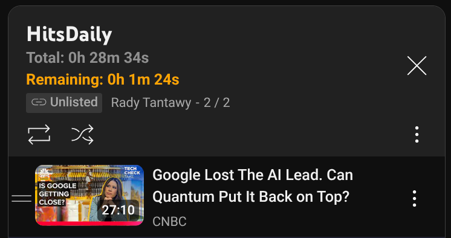

## 🔌 Load the Extension in Chrome

Follow these steps to load the extension locally in your Chrome browser:

1. **Open Chrome and go to the Extensions page:**

2. **Enable Developer Mode**

Toggle the switch in the top right corner of the page.

3. **Click "Load unpacked"**

4. **Select the extension folder**

Choose the folder containing your `manifest.json` file.

5. **Done!** 🎉  
The extension should now appear in your extensions list.

6. **Browse your Youtube playlist, you should see total duration and remaining duration in playlist header**

 
7. **To update after changes:**

- Make code changes
- Go back to `chrome://extensions/`
- Click the **"Reload"** button on your extension card
